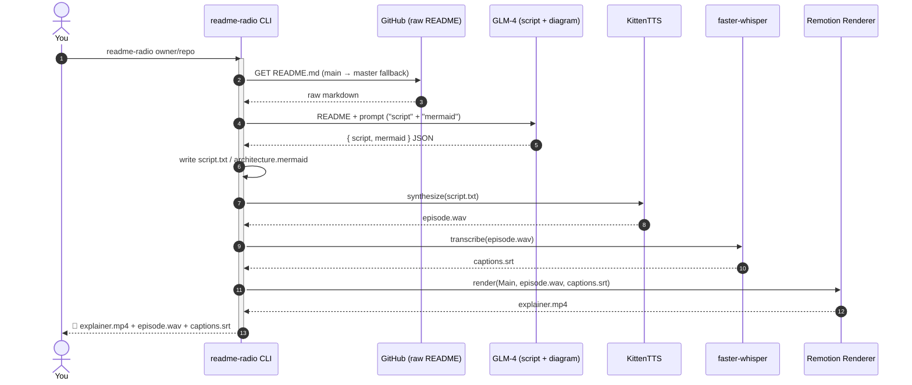
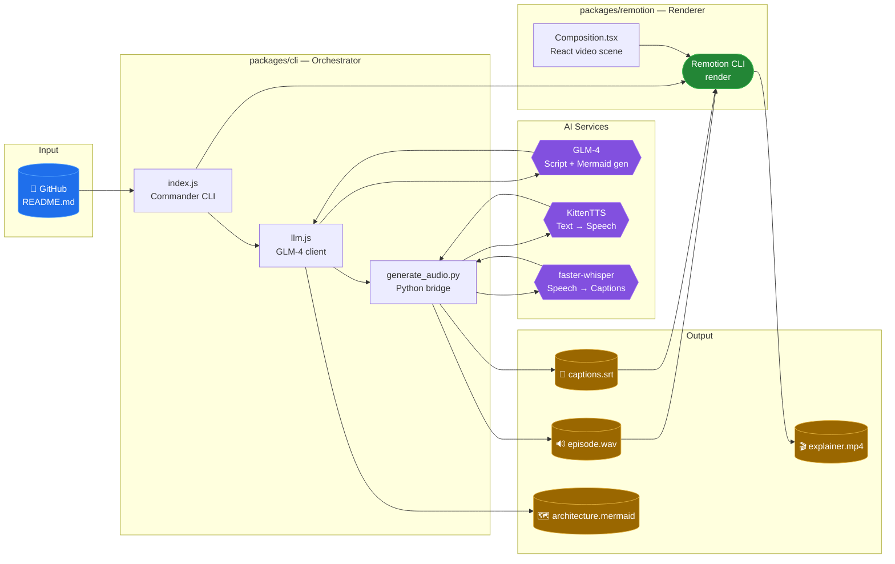
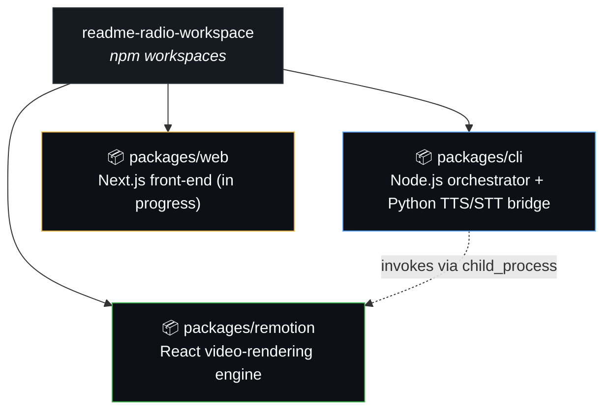
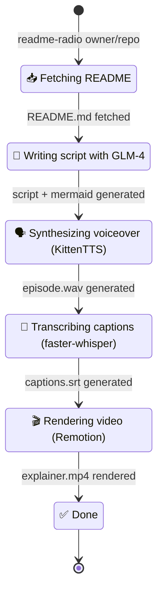

<div align="center">

# 📻 README Radio

### Turn any GitHub repository into a slick, narrated explainer video — automatically.

`README.md` in → 🎙️ voiceover + 📽️ captioned video out.

[](https://nodejs.org)
[](https://www.python.org)
[](https://www.remotion.dev)
[](https://nextjs.org)

</div>

---

## ✨ What it does

Point README Radio at any GitHub repo and it will:

1. 📥 Pull the repo's `README.md`
2. 🧠 Ask an LLM to turn it into a **spoken-word script** *and* a **Mermaid architecture diagram**
3. 🗣️ Synthesize the script into a voiceover, with word-accurate captions
4. 🎬 Render everything into a captioned explainer video with Remotion

All from a single terminal command.

## 🎞️ Demo Flow



## 🏗️ Architecture



## 📦 Monorepo Layout



| Package | Role | Status |
|---|---|---|
| [`packages/cli`](packages/cli) | The `readme-radio` command — fetches the README, calls the LLM, drives audio/caption generation, and kicks off the Remotion render | ✅ Functional end-to-end pipeline |
| [`packages/core`](packages/core) | Shared repository validation, Mermaid parsing, cycle-safe layout, and cue matching | ✅ Tested |
| [`packages/remotion`](packages/remotion) | Responsive Remotion renderer for landscape, square, and portrait videos | ✅ Functional |
| [`packages/web`](packages/web) | Interactive Next.js studio with queued jobs, real-time progress, cancellation, transcript seeking, and downloads | ✅ Functional |

## 🛠️ Tools & Tech Stack

<table>
<tr><td valign="top">

**Orchestration**
- Node.js + [Commander](https://github.com/tj/commander.js) — CLI framework
- [Axios](https://axios-http.com) — HTTP client for GitHub/LLM calls
- [Ora](https://github.com/sindresorhus/ora) — terminal spinners

</td><td valign="top">

**AI / Generation**
- [GLM-4](https://open.bigmodel.cn) (Zhipu AI) — script & Mermaid diagram generation
- [KittenTTS](https://github.com/KittenML/KittenTTS) — lightweight text-to-speech
- [faster-whisper](https://github.com/SYSTRAN/faster-whisper) — speech-to-text for captions

</td></tr>
<tr><td valign="top">

**Video**
- [Remotion](https://www.remotion.dev) — React-based programmatic video rendering
- [Tailwind CSS](https://tailwindcss.com) — styling inside video compositions

</td><td valign="top">

**Web**
- [Next.js](https://nextjs.org) 16 + React 19
- TypeScript across all packages

</td></tr>
</table>

## 🚀 Getting Started

```bash
# 1. Install JS dependencies (npm workspaces)
npm install

# 2. Install Python deps for TTS/STT
cd packages/cli
pip install -r requirements.txt

# 3. Configure your GLM API key
cp .env.example .env
# then edit .env and set GLM_API_KEY=your_key

# 4. Generate an explainer video for any repo
node index.js pallets/flask
# or, if linked globally:
readme-radio pallets/flask
```

Run the interactive studio from the repository root:

```bash
npm run dev
```

Open `http://localhost:3000`, enter a public GitHub repository, and choose the narration tone, duration, renderer, and aspect ratio. Each request runs in an isolated job directory and streams real pipeline progress to the browser.

Optional server controls:

```bash
README_RADIO_CONCURRENCY=1       # simultaneous worker limit
README_RADIO_RATE_LIMIT=6        # generation requests per IP per hour
README_RADIO_API_TOKEN=...       # bearer token for direct API access
```

**Output:** `script.txt`, `architecture.mermaid`, `episode.wav`, `captions.srt`, `explainer.mp4`

## 🧭 Pipeline Stages



## ✅ Quality checks

```bash
npm test       # shared parser, layout, cue, and repository validation tests
npm run lint   # Next.js, Remotion, and TypeScript checks
npm run build  # Remotion bundle and production web build
npm run check  # all of the above
```

The bundled worker architecture is intended for a persistent, self-hosted Node process. A serverless deployment should move workers and generated artifacts to a durable queue and object storage while keeping the same `/api/jobs` contract.

---

<div align="center">
<sub>Built with 🎧 by Build Fast with AI</sub>
</div>
